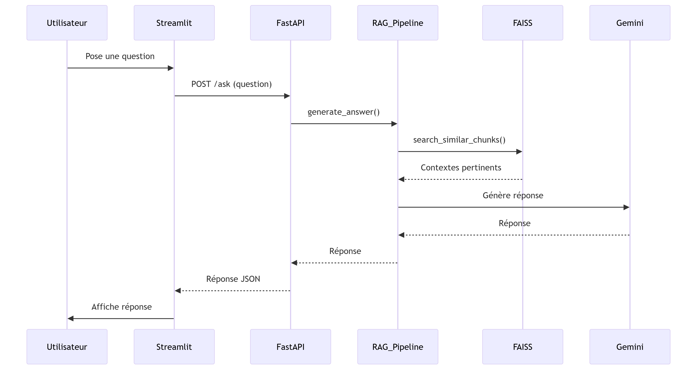

## 1. Présentation du projet

Ce projet consiste à créer un système de question-réponse intelligent basé sur des documents PDF d'appels d’offres. Il permet de téléverser un fichier PDF, de le traiter via un pipeline RAG (Retrieval-Augmented Generation), et de poser des questions en langage naturel pour obtenir des réponses précises et sourcées.

Le système repose sur :

* L’extraction de texte et découpage en chunks.
* La vectorisation avec Sentence Transformers.
* L’indexation locale avec FAISS.
* La génération de réponses contextuelles via un modèle `mistral:instruct`.

## 2. Fonctionnalités principales

* Téléversement de fichiers PDF d’appels d’offres.
* Extraction et découpage du contenu des documents.
* Indexation des données sous forme vectorielle.
* Recherche des passages pertinents.
* Génération de réponse via un LLM (`mistral:instruct`).
* API REST avec FastAPI.
* Interface utilisateur avec Streamlit.
* Suppression dynamique de fichiers.

## 3. Architecture technique



## 4. Structure du projet


PROJET-RAG-TECFORGE

```
backend/
  app.py               : point d’entrée du backend avec FastAPI
  faiss_index.index    : index vectoriel FAISS contenant les embeddings des documents
  docs.pkl             : textes segmentés et sérialisés (format pickle)
  index_pdf.py         : script d’extraction et d’indexation des fichiers PDF
  rag_pipeline.py      : pipeline RAG qui gère la recherche contextuelle et la génération de réponse via Mistral
data/
  Répertoire pour les fichiers PDF chargés par l’utilisateur
frontend/
  streamlit_app.py     : interface web développée avec Streamlit pour interagir avec le système
.env                   : fichier contenant les paramètres et clés (si besoin)
config.py              : fichier de configuration global (chemins, paramètres, modèle)
README.md              : documentation du projet (instructions, installation, utilisation)
requirements.txt       : dépendances Python du projet
```

## 5. Étapes d’installation

```bash
git clone https://github.com/Hajji-ahmed/rag-appels-offres.git
cd projet-rag-tecforge
python -m venv venv
source venv/bin/activate  # ou venv\Scripts\activate sous Windows
pip install -r requirements.txt
```

Créer un fichier `.env` à la racine (si un backend local comme Ollama est utilisé) :

```
LLM_BACKEND_URL=http://localhost:11434
MODEL_NAME=mistral:instruct
```

## 6. Lancement du projet

### Démarrer le backend (FastAPI)

```bash
uvicorn backend.app:app --reload --port 8000
```

### Démarrer le frontend (Streamlit)

```bash
streamlit run frontend/streamlit_app.py
```

## 7. Utilisation

1. Téléverser un PDF via l’interface.
2. Indexer le fichier.
3. Poser une question sur le contenu.
4. Obtenir une réponse générée automatiquement.

## 8. Technologies utilisées

| Technologie                     | Rôle                                 |
| ------------------------------- | ------------------------------------ |
| FastAPI                         | API REST                             |
| Streamlit                       | Interface utilisateur web            |
| FAISS                           | Indexation vectorielle locale        |
| Sentence Transformers           | Génération d’embeddings              |
| Mistral (via Ollama ou LocalAI) | Génération de réponses               |
| LangChain                       | Pipeline de question-réponse         |
| PyMuPDF / pdfplumber            | Extraction de texte des fichiers PDF |

---

